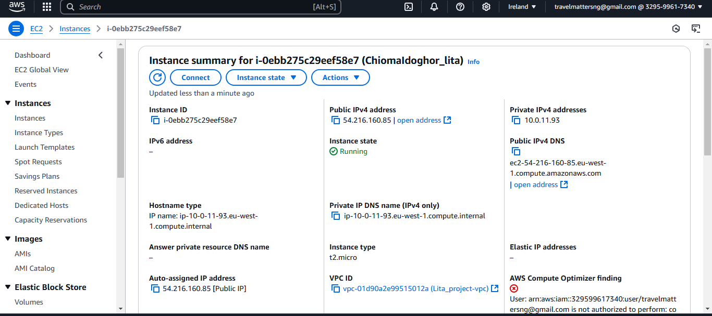

# Lita-SmartShop-Ec2-Instance

How i design and deploy a reliable web application infrastructure on AWS and Deploy an Apache Server for a Smart Shop
Develop a solution that meets SmartShop's requirements by leveraging AWS services such as EC2,
Virtual Private Cloud (VPC), and Identity and Access Management (IAM).

### This project explains the following:

#### Creating EC2 Instance

- How I Set Up the Application Environment and ensure Access and Connectivity:
  I launch an EC2 Instances(named: i-0ebb275c29eef58e7 (ChiomaIdoghor_lita) ) to Host my Web Application

#### Creating Security Group

- How I Configure Security Groups with the name: sg-03a67acbb43c50031 - ChiomaMargaret_LitaSG.
  I, Allow HTTP (port 80) and HTTPS (port 443) traffic from the internet, and
  Restrict SSH (port 22) access to my IP addresses only

#### Creating and deploying Apache Server

- How I deployed an Apache web server
  

  #### Documentation

- Documentation and Presentation : I Documented all configurations and security groups
